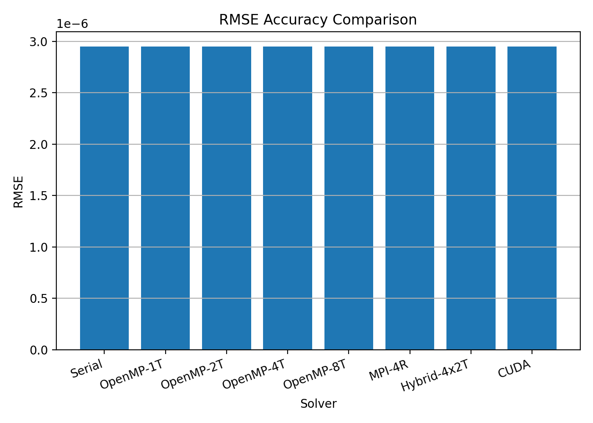
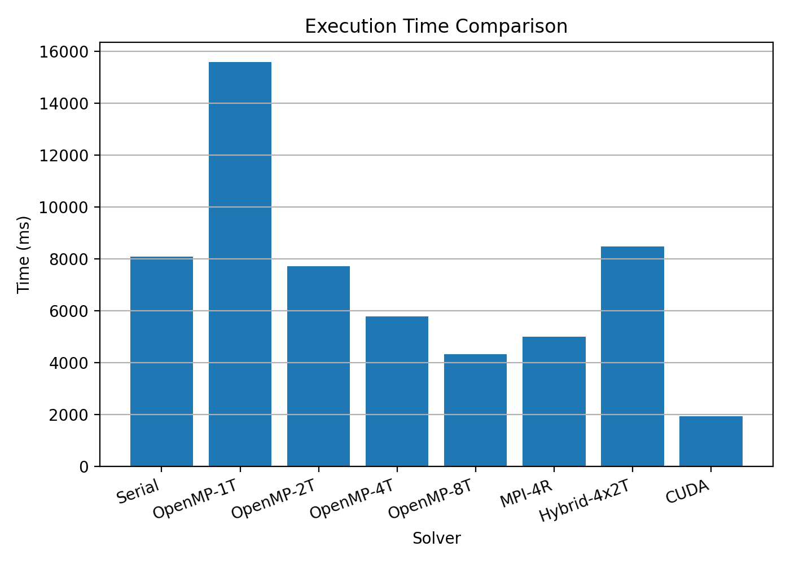
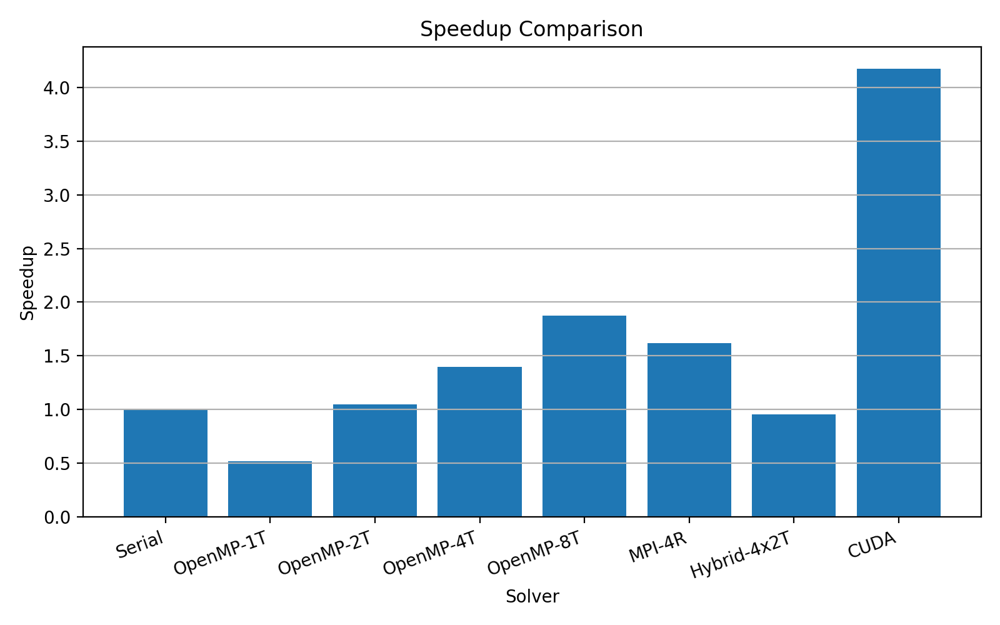
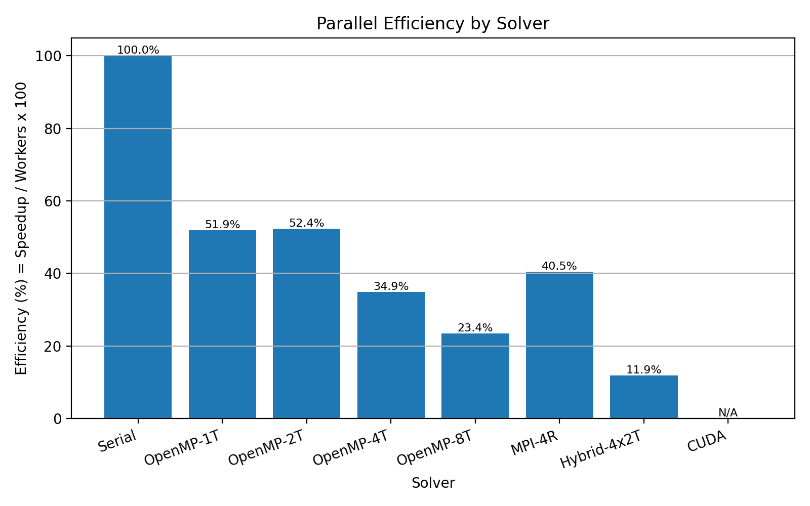
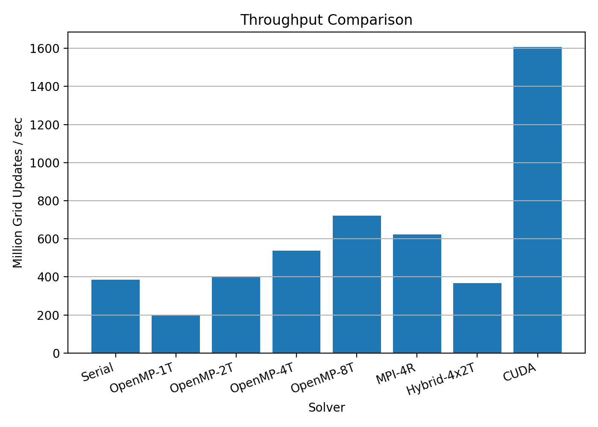

# Analysis Report: Parallel 2D Heat Equation Solver

## 1. Project Overview

This project implements and analyzes a two-dimensional heat equation solver using the Forward-Time Central-Space (FTCS) finite difference method. The simulation models heat diffusion over a square plate with fixed zero-temperature boundary conditions.

The governing equation is:

```text
dT/dt = alpha * (d2T/dx2 + d2T/dy2)
```

The numerical update equation used by the serial and parallel programs is:

```text
T_new[i,j] = T_old[i,j]
           + rx * (T_old[i+1,j] - 2*T_old[i,j] + T_old[i-1,j])
           + ry * (T_old[i,j+1] - 2*T_old[i,j] + T_old[i,j-1])
```

where:

```text
rx = alpha * dt / dx^2
ry = alpha * dt / dy^2
```

The main objective of the project is to compare the performance and accuracy of:

- Serial CPU implementation
- OpenMP shared-memory implementation
- MPI distributed-memory implementation
- Hybrid MPI + OpenMP implementation
- CUDA GPU implementation

The test case used for the recorded results was a `500 x 500` grid with final simulation time `0.5 s`.

The CPU-based results were generated on the current laptop. Since CUDA cannot be executed on this laptop, the CUDA row was loaded from the previously generated `cuda/summary_2d_cuda.csv` file. Therefore, CUDA is included to show the GPU implementation output, but its timing was not regenerated in the same laptop run as the CPU results.

## 2. Parallel Programming Concepts Applied

The heat equation update is a stencil computation. Each grid point at the next time step depends only on its own value and its four direct neighbors from the previous time step. This makes the problem suitable for parallel programming because many grid points can be updated independently within the same time step.

### Parallelization Diagram

```mermaid
flowchart TD
    A[Initial 2D temperature grid] --> B[Time-stepping loop]
    B --> C{Parallel model}

    C --> D[Serial CPU]
    D --> D1[One processor updates all interior grid points]

    C --> E[OpenMP]
    E --> E1[Shared-memory threads divide the 2D loop]
    E1 --> E2[collapse(2) parallel stencil update]

    C --> F[MPI]
    F --> F1[Grid rows divided among MPI ranks]
    F1 --> F2[Each rank stores local rows plus ghost rows]
    F2 --> F3[Neighbor ranks exchange boundary rows]
    F3 --> F4[Each rank updates its local subdomain]

    C --> G[Hybrid MPI + OpenMP]
    G --> G1[MPI divides the grid into row blocks]
    G1 --> G2[OpenMP threads update rows inside each MPI rank]

    C --> J[CUDA]
    J --> J1[GPU thread blocks divide the 2D grid]
    J1 --> J2[CUDA kernel updates interior stencil points in parallel]

    D1 --> H[Final numerical temperature field]
    E2 --> H
    F4 --> H
    G2 --> H
    J2 --> H
    H --> I[Compare execution time, speedup, efficiency, RMSE, throughput]
```

### Description of the Parallel Approach

In the serial version, the whole `500 x 500` grid is stored in memory and updated by a single CPU thread. For every time step, the program loops through all interior points and applies the FTCS stencil formula.

In the OpenMP version, the same grid remains in shared memory, but the nested loops over the two-dimensional grid are parallelized using:

```cpp
#pragma omp parallel for collapse(2) schedule(static)
```

This allows multiple threads to update different grid points at the same time. Since the computation reads from `T_old` and writes to `T_new`, there is no write conflict between threads during the stencil update.

In the MPI version, the grid is divided by rows. Each MPI process receives a contiguous block of rows. Since the stencil needs neighboring rows, each process stores two additional ghost rows. Before each update step, neighboring MPI ranks exchange their boundary rows using `MPI_Sendrecv`. After halo exchange, every rank updates only its own local subdomain.

In the hybrid MPI + OpenMP version, the grid is first divided across MPI ranks, and then each rank uses OpenMP threads to update its local rows. This combines distributed-memory parallelism from MPI with shared-memory parallelism from OpenMP.

In the CUDA version, the stencil computation is moved to the GPU. CUDA thread blocks cover the two-dimensional grid, and each thread updates one grid point where possible. The host code copies the initialized temperature field to the device, launches the time-stepping kernels, and copies the final temperature field back for accuracy and summary output.

## 3. Accuracy Compared to Serial Code

Accuracy was measured using the Root Mean Square Error (RMSE). Two types of accuracy checks were used:

- RMSE against the analytical solution of the heat equation
- RMSE against the serial numerical result, where direct comparison was available

The analytical solution used is:

```text
T(x,y,t) = 100 * exp(-2 * alpha * pi^2 * t) * sin(pi*x) * sin(pi*y)
```

### Accuracy Results

| Solver | Workers | RMSE vs Analytical | RMSE vs Serial | Max Temperature |
|---|---:|---:|---:|---:|
| Serial | 1 | 2.947695e-06 | 0.000000e+00 | 90.600938 |
| OpenMP-1T | 1 | 2.947695e-06 | 0.000000e+00 | 90.600938 |
| OpenMP-2T | 2 | 2.947695e-06 | 0.000000e+00 | 90.600938 |
| OpenMP-4T | 4 | 2.947695e-06 | 0.000000e+00 | 90.600938 |
| OpenMP-8T | 8 | 2.947695e-06 | 0.000000e+00 | 90.600938 |
| MPI-4R | 4 | 2.947690e-06 | 2.880623e-07 | 90.600900 |
| Hybrid-4x2T | 8 | 2.947690e-06 | 2.880623e-07 | 90.600900 |
| CUDA | 0 | 2.947700e-06 | 2.561886e-05 | 90.600900 |

The results show that the parallel versions produce almost identical numerical accuracy to the serial implementation. The OpenMP versions match the serial result exactly in the recorded comparison, with RMSE vs serial equal to zero. MPI, Hybrid, and CUDA also have very small RMSE vs serial values, showing that the parallel implementations preserve the numerical solution.

The RMSE plot generated by the project is shown below. This graph compares the numerical error of each solver against the analytical solution. Since all bars are almost the same height, it shows that Serial, OpenMP, MPI, Hybrid, and CUDA all produced nearly the same final temperature field for the selected test case.



## 4. Timing and Performance Analysis

The execution time was measured for the serial program and several parallel configurations. Speedup was calculated using:

```text
Speedup = Serial execution time / Parallel execution time
```

Parallel efficiency was calculated using:

```text
Efficiency = (Speedup / Number of workers) * 100
```

For this project, efficiency is mainly meaningful for CPU-based parallel methods where the worker count is clearly defined, such as OpenMP threads, MPI ranks, or Hybrid MPI ranks multiplied by OpenMP threads. CUDA uses a GPU execution model with many hardware-managed threads, so CPU-worker efficiency is shown as not applicable in the graph rather than interpreted like OpenMP or MPI efficiency.

Throughput was calculated as million grid updates per second.

### Timing Results

| Solver | Workers | MPI Ranks | OpenMP Threads | Execution Time (ms) | Speedup | Efficiency (%) | Throughput (MPoints/s) |
|---|---:|---:|---:|---:|---:|---:|---:|
| Serial | 1 | 1 | 1 | 11379.0920 | 1.000000 | 100.0000 | 273.5280 |
| OpenMP-1T | 1 | 1 | 1 | 13200.2896 | 0.862034 | 86.2034 | 235.7903 |
| OpenMP-2T | 2 | 1 | 2 | 7885.6087 | 1.443020 | 72.1510 | 394.7064 |
| OpenMP-4T | 4 | 1 | 4 | 8945.7376 | 1.272013 | 31.8003 | 347.9311 |
| OpenMP-8T | 8 | 1 | 8 | 4095.8846 | 2.778177 | 34.7272 | 759.9091 |
| MPI-4R | 4 | 4 | 0 | 5105.1100 | 2.228961 | 55.7240 | 609.6832 |
| Hybrid-4x2T | 8 | 4 | 2 | 4792.7800 | 2.374215 | 29.6777 | 649.4143 |
| CUDA | 0 | 0 | 0 | 1937.9500 | 5.871716 | 0.0000 | 1606.0786 |

### Performance Graphs

Execution time:

This graph shows the total time taken by each solver to complete the simulation. Lower values mean better performance. It is useful for comparing how long the serial, CPU-parallel, distributed, hybrid, and GPU implementations took for the same `500 x 500` problem size. The CUDA bar comes from the saved CUDA summary file, while the CPU bars come from the current laptop run.



Speedup:

This graph shows how many times faster each method was compared with the serial baseline. A speedup of `1.0` means the method performed the same as the serial version, while values above `1.0` indicate improvement. The OpenMP 1-thread result is below `1.0` because it includes parallel runtime overhead without real parallel benefit. CUDA speedup is calculated by the comparison file using the current serial time and the saved CUDA time, so it should be read with the CUDA environment limitation in mind.



Efficiency:

This graph shows how effectively the CPU-based parallel workers were used. Efficiency is calculated as `(speedup / number of workers) x 100`. Higher efficiency means each additional CPU worker contributed more useful performance. CUDA is marked as not applicable because GPU execution uses a different worker model from CPU threads and MPI ranks.



Throughput:

This graph shows the number of grid updates completed per second, measured in million points per second. Higher throughput means the solver processed more grid cells in less time. This metric is helpful because it connects performance directly to the amount of numerical work completed.



## 5. Discussion

The OpenMP implementation improved performance overall as the number of threads increased. The best recorded OpenMP result was obtained with 8 threads, reducing execution time from `11379.0920 ms` to `4095.8846 ms`. This gave a speedup of approximately `2.78x`.

The OpenMP 1-thread result was slower than the serial version because it includes OpenMP runtime overhead without useful parallel benefit. With 2, 4, and 8 threads, the workload is divided among more CPU threads, so the execution time decreases and throughput increases.

The MPI implementation using 4 ranks achieved `5105.1100 ms`, giving a speedup of `2.23x`. The MPI version performs well because the row-wise domain decomposition divides the grid across ranks while requiring only neighboring ghost-row communication.

The hybrid MPI + OpenMP implementation used 4 MPI ranks and 2 OpenMP threads per rank, for 8 total workers. Its execution time was `4792.7800 ms`, giving a speedup of `2.37x`. It improved over the serial version and was faster than the MPI-only run in this recorded comparison.

The CUDA implementation result was loaded from an existing CUDA output file because the current laptop cannot run CUDA. The CUDA file reports `1937.9500 ms` and throughput of `1606.0786 MPoints/s`. Since this timing was not regenerated on the same laptop as the CPU runs, it should be treated as a valid CUDA implementation output but not as a strict same-machine performance comparison.

Efficiency generally decreases as the number of workers increases. This is expected in parallel programs because overheads such as thread creation, synchronization, memory bandwidth limits, and MPI communication become more significant as more workers are added.

## 6. Conclusion

The project successfully applied parallel programming concepts to a 2D heat equation solver. OpenMP was used for shared-memory loop parallelism, MPI was used for distributed-memory domain decomposition with halo exchange, the hybrid version combined both CPU approaches, and CUDA moved the stencil update to the GPU.

The parallel implementations maintained the accuracy of the serial solver. The RMSE values remained approximately `2.94769e-06`, and the OpenMP and CUDA results matched the serial numerical result in the recorded comparison.

For the tested `500 x 500` grid, the CPU-based parallel approaches improved over the serial baseline except the OpenMP 1-thread run, where runtime overhead outweighed useful parallel work. Among the CPU results generated on the current laptop, OpenMP-8T had the lowest execution time. The CUDA result is included from the existing CUDA summary file to demonstrate the GPU version, but it should be interpreted with the environment limitation noted above.

Overall, the results show that stencil-based heat equation solvers are suitable for parallelization, but the best parallel model depends on grid size, number of workers, communication cost, and memory bandwidth.
